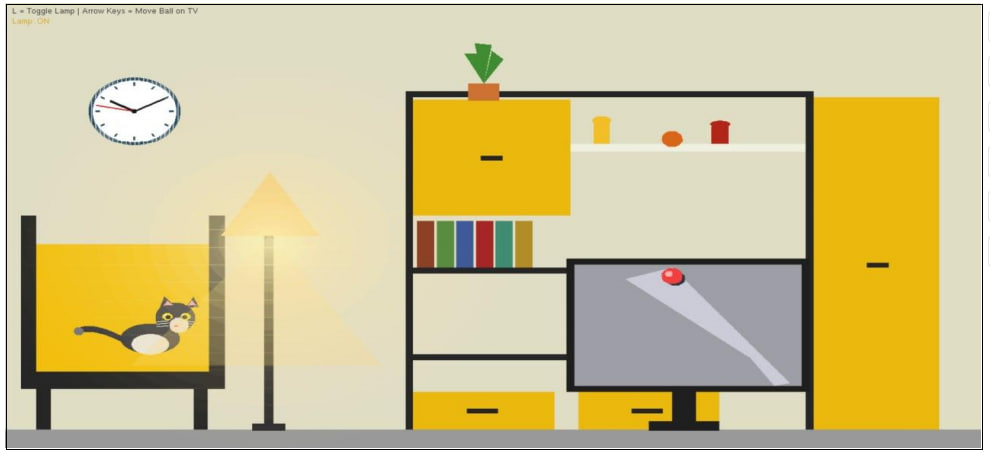
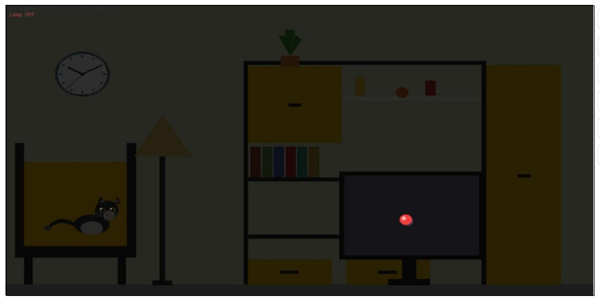

# 🏠 Interactive Living Room (OpenGL Project)

## 📌 Overview
This is a 2D interactive living room simulation developed using C++ and OpenGL. The project demonstrates computer graphics concepts like animation, lighting, and user interaction.

## 🎯 Features
- Lamp ON/OFF toggle  
- Animated wall clock  
- Moving ball on TV  
- Animated cat  
- Keyboard controls  

## 🧠 Concepts Used
- Midpoint Circle Algorithm  
- 2D Transformations  
- Animation (Timer)  
- OpenGL Rendering  

## 🛠️ Technologies
- C++  
- OpenGL (GLUT)  

## 🎮 Controls
- L → Lamp ON/OFF  
- Arrow Keys → Move ball  
- ESC → Exit  

## 📷 Output
  

## 📄 Project Report
[Download Report](CG_Project_Report.pdf)

## 👥 Team Members
- Romana Akter Runa  
- Shipon Chandra Mondal  
- Ismail Hoissen  

## 📫 Contact
Email: runaakter6723@gmail.com
